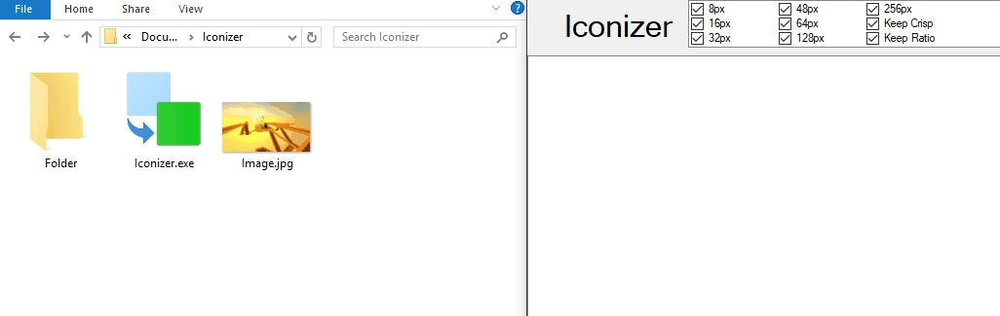

# Iconizer

Image to Icon Converter with High Quality Output

[Download Binary](Info/Iconizer.exe)

## Usage

There are range of software that offer Bitmap to Icon conversion, but most of them are either too simple (only write one image per icon) or too complicated (too much button/steps). This program tries to solve this problem.

## Features

In very simple step: Drag in, then drag out. You can do this with multiple files.

In longer explanation you can drag Bitmaps `*.jpg, *.png, *.bmp` inward to add them in collections, or do this via Add Button. Other than bitmaps, you also can drag in binary files `*.exe, *.dll` to extract icons inside it. The software automatically pick the clearest image in case the icon is packed to multiple images.

While it`s easy to drag in, it`s also legit to drag it out. You drag the selected icon out to the folder destination in explorer. All image processing is done quickly after you hold and move the mouse. It just works. 

However if you want the convenient way to save these icons, you can hit the `Quick Save` to save the icons in the same folder with each image sources. Or use the obvious `Save...` button to place all of the icons in one place together.

Options above the header determines how the icon output should be generated. All `..px` options determines which resolutions should be generated and packet to the icon. `Keep crisp` means the icon won`t generate larger images if source is not large enough to avoid blur. `Keep ratio` means the icon won`t stretched out in case if the image doesn`t have equal width and height.

There also cool hidden trick: If you drag one icon out with helding down the control key, it`ll also generate `desktop.ini` refering to the icon in destination folder, thus changing the folder icon in instant. Of course, the change can`t be see instantly. That`s why after that, then switching focus to the software, the explorer `blink` to update its cache. Internally this equivalent to call `ie4uinit -show` in cmd to invalidate explorer cache.

## Credit

(c) 2017 Wildan Mubarok

This software uses [IconExtractor](https://github.com/TsudaKageyu/IconExtractor/) to pull icons from binaries.

This software uses code snippets from SE [here](https://stackoverflow.com/a/32530019/3908409), [here](https://stackoverflow.com/a/24199315/3908409), [here](https://stackoverflow.com/a/1078898/3908409) to build the software faster than I thought.

Unless otherwise stated, the code is redistributed under MIT License